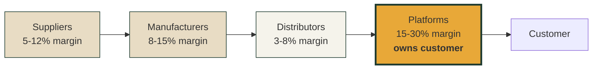

# Gate HTML Output

All human-review content in this skill (gate decisions, framework signal reviews, concept comparisons, stress test scorecards) renders as a self-contained HTML file via the **html-output skill** (`.claude/skills/html-output/SKILL.md`), not as markdown. This is a hard rule.

Source of the requirement: McKinsey/BCG-style strategy work depends on diagrams and visual layouts to make value chains, framework comparisons, and stress test scorecards legible at a glance. Markdown can't carry that load. Test run `dtc-ecommerce-us` (2026-05-19) confirmed: markdown gate reports require multiple plain-English re-explanations from the user, indicating the format failed.

## How to invoke

At each gate, instead of presenting markdown, the orchestrator:

1. Assembles the structured content the gate needs (data + concepts + diagrams)
2. Calls the html-output skill with this brief:

```
Use the html-output skill to render this gate review.

Archetype: [from table below]
Content: [structured data + concept explainers + diagram specs]
Save location: 08-knowledge/world-model/industries/[slug]/gates/gate-[N]-[date].html

The HTML must include:
  - Plain-English explainers for every framework/concept named (see "concept
    explainer requirement" below)
  - The diagrams listed in the archetype row
  - Memorable concept handles alongside structured IDs (RULE-1 from edge-cases)
  - The standard html-output export footer
  - The standard four-line gate prompt at the end (Why we're asking / Default /
    Tradeoff / Or)
```

3. After html-output saves the file, the orchestrator surfaces the path to the user and stops.

## Archetype mapping per gate

| Gate | What it reviews | Archetype | Required diagrams |
|---|---|---|---|
| Gate 1 | Scope + data sources | `report.html` | None (scope is text-heavy); table of inherited inputs |
| Phase 1 internal review | Value chain + market structure | `diagram-mermaid.html` (primary) embedded in a `report.html` | Mermaid flowchart of value chain nodes + flows with margin pools shaded |
| Phase 2 internal review | Value chain pain audit | `dashboard.html` | Heatmap (entity type × pain activity intensity), JTBD opportunity scatter (importance vs satisfaction), non-consumption funnel |
| Phase 3 internal review | Enabling conditions | `timeline.html` + Mermaid | 5-axis timeline of conditions by date; Venn-style intersection diagram |
| Gate 2 | Dataset + framework signals review | `consulting deck` archetype (`slide-deck.html`) | Per-framework signal cards; counter-positioning trap diagrams; 7 Powers trajectory per signal; **value chain diagram repeated for orientation** |
| Phase 5 internal review | Concept generation | `comparison-table.html` | Move-fit pre-screen with star ratings; diversity check across 4 dimensions |
| Gate 3 | Ranked shortlist + stress test | `consulting deck` archetype | Stress test scorecard (4-test × N-concept matrix with color coding); ranked shortlist cards; idea maze timeline per top concept; incumbent war-game timeline |

The orchestrator decides at each gate whether the content warrants a full HTML render or whether a quick in-conversation summary is sufficient. **Default to render.** Markdown is the exception, only used for:

- Brief acknowledgments ("Gate 2 approved, proceeding to Phase 5")
- Trivial confirmations
- Internal tool output that no human reviews

If a human will read it and make a decision from it → render as HTML.

## Concept explainer requirement

Every framework, business model concept, Thiel Secret, or piece of jargon that appears in a human-review HTML must include a **one-sentence plain-English explainer** the first time it appears, even if it's been used before.

Format: a small box, tooltip, or italicized line directly below the term.

### Concepts that MUST get explainers

| Concept | Plain-English explainer (use verbatim or close) |
|---|---|
| Aggregation Theory (Ben Thompson) | When fragmented supply meets concentrated demand, the platform that owns the user relationship wins — suppliers compete to reach those users. |
| Blue Ocean ERRC | Four questions: which competitive factors should we **Eliminate**, **Reduce**, **Raise**, or **Create**? The Create column matters most — factors no one offers that customers want. |
| Decoupling (Teixeira) | Strip one specific activity out of the customer journey and own just that piece — let customers complete the rest with the incumbent. Netflix did this to Blockbuster with subscription. |
| Counter-positioning (Helmer) | Adopt a business model the incumbent cannot copy without hurting their existing profit pool. Forces them to choose between defending the old business and competing with you. |
| 7 Powers (Helmer) | Seven durable competitive positions: scale economies, network economies, counter-positioning, switching costs, branding, cornered resource, process power. At entry, only counter-positioning or cornered resource are available. |
| Thiel's Secret | A contrarian but defensible belief — something important very few people agree with you on. Used here as a strategic lens that suggests experiments, not as a high-conviction filter. |
| Idea Maze (Srinivasan) | The map of every prior attempt at a concept, why each failed, and what's different now. Concepts that haven't run the maze get killed by repeating known failures. |
| Jobs to Be Done (Christensen) | People hire products to do jobs. Understanding the job — functional, emotional, social — reveals where current solutions fail. |
| Why-Now (a16z / Wing VC) | The specific dated condition that makes a previously-impossible model viable today. Must name what just changed in the last 1-5 years, not handwave at trends. |
| Value chain | The end-to-end sequence of who does what to deliver value to the end customer — suppliers, manufacturers, distributors, platforms, customers — and where margin pools sit. |
| Margin pool | Where profit actually concentrates in the value chain. Often different from where revenue concentrates. |
| V/C/A/I provenance | Tag on every fact-claim: **V**alidated (primary doc) / **C**orroborated (≥2 sources) / **A**sserted (single source, suspect) / **I**nferred (analytical derivation). |

The orchestrator maintains this glossary as a JSON block in the HTML head and renders explainers via tooltip or inline italic on first appearance of each term.

## Memorable concept handles (RULE-1 from edge-cases)

Every venture concept, framework signal, and endorsed Thiel Secret carries a **memorable handle alongside its structured ID** in any HTML gate review.

Handle format: 3-5 words, self-descriptive enough that a senior reader recognizes the idea without needing to read the one-liner.

Examples:
- ✅ "Wirecutter-for-niche, AI-citation-first"
- ✅ "Stripe-for-merchant-agent-protocols"
- ✅ "Substack for niche product authority"
- ❌ "M1-DTC" (code only)
- ❌ "AUTH" (acronym only)
- ❌ "AI-native DTC platform" (generic)

The HTML renders the handle as the H3/card title; the structured ID appears as a small monospace tag (e.g. `M4 · concept_id: own-the-evaluate-job`) beneath it.

## Diagram patterns to use

### Value chain (Phase 1 — required)
Mermaid flowchart, left-to-right. Nodes shaded by margin pool size. Edges labeled with friction level. Customer-relationship-owner node has a thick border. Data-owner node has a dashed border.



### Pain heatmap (Phase 2)
Table with entity type rows, customer journey activity columns. Cell color from light to dark green based on intensity × frequency score. Workaround named in tooltip on hover.

### JTBD opportunity scatter (Phase 2)
Chart.js scatter plot. X-axis: satisfaction (1-10). Y-axis: importance (1-10). Each job a dot, sized by segment size. Upper-left quadrant (high importance, low satisfaction) shaded — these are the disruption opportunities.

### Why-now timeline (Phase 3)
Horizontal timeline with 5 swimlanes (tech / cost / behavioral / regulatory / supply). Conditions plotted by date. Intersections marked where ≥2 conditions reach maturity in the same quarter.

### Counter-positioning trap (Phase 4.4)
For each incumbent: a 2-column visual. Left column: their load-bearing profit pool. Right column: our business model. Arrow showing the structural conflict. Below: timeline of their plausible responses with constraints annotated.

### Stress test scorecard (Phase 6 / Gate 3)
4 × N grid. Rows: concepts (with memorable handles). Columns: why-now, idea-maze, incumbent-response, moat. Cell color: green (STRONG) / amber (ITERATE) / red (KILL). Overall verdict in the rightmost column.

### Ranked shortlist (Gate 3)
Card layout. One card per concept. Card header: memorable handle + verdict badge. Body: one-line description, top non-obvious reason, top risk, required-iteration items. Footer: linked detail (anchor to full concept in same page).

## Save locations

- Gate HTML files: `08-knowledge/world-model/industries/[slug]/gates/gate-[N]-[YYYY-MM-DD].html`
- Phase internal HTML reviews (Phase 1/2/3/5): `08-knowledge/world-model/industries/[slug]/gates/phase-[N]-review-[YYYY-MM-DD].html`
- Final shortlist HTML (Gate 3 approved): `08-knowledge/world-model/industries/[slug]/venture-concepts.html` (in addition to the markdown version)

## Anti-patterns

- ❌ Rendering a gate review as a markdown table in chat instead of HTML
- ❌ Including framework names without plain-English explainers
- ❌ Using concept codes (M1, M2) without memorable handles
- ❌ HTML with no diagrams when a diagram would clarify (especially: value chain, stress test scorecard, ranked shortlist)
- ❌ HTML without the standard export footer
- ❌ Multiple HTML files when one consolidated dashboard would serve better
- ❌ HTML that just dumps the markdown into a styled wrapper — must use the diagrams and visual layout the format enables

## When markdown is still acceptable

- Internal scratch files in `working/`
- `disruption-dataset.yaml` (it's a data structure, not a review surface)
- `signals-log.md` (append-only log)
- `bar-test.md` (sub-agent JSON output)
- Brief acknowledgments in chat ("Gate 1 approved, proceeding")

The bar test sub-agent reads the HTML files for the human-facing review surface, plus the dataset YAML for ground truth.
